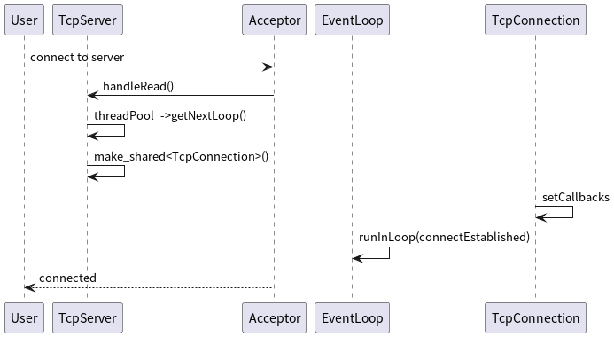
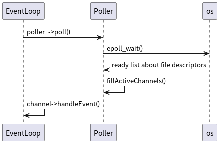
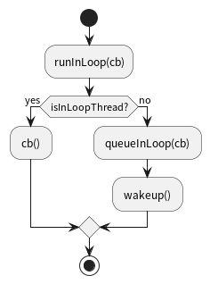

# Table of Contents

1.  [新连接](#org83778f1)
2.  [事件轮询](#orga4afa0e)
3.  [TcpConnection 回调函数](#orgba32ed1)

# 新连接

# 事件轮询

`epoll_wait()` 返回的文件描述符被封装到 Channel 中，在 Channel 中有 setReadCallback, setWriteCallback 等函数用于设置在 `EPOLL_IN`, `EPOLL_OUT` 等事件发生时的处理函数。

TcpConnection, EventLoop 和 Acceptor 三个对象都有一个 Channel 成员。

Acceptor 中的 Channel 成员关注新连接，客户端连接服务器导致 Channel 可读； TcpConnection 代表客户端与服务端之间的 tcp 连接，其中的 Channel 关注连接上的可读可写事件，处理客户请求，发送响应。

程序运行时，每个线程都在执行 `EventLoop::loop()` ，阻塞在其中的 `poller_->poll()` 方法。新的连接到来，会创建一个 TcpConnection 对象（并将其中的 Channel 成员加入 Poller， `epoll_ctl` ），然后执行 `runInLoop(TcpConnection::connectEstablished, conn)` 。

`wakeup()` 向该 EventLoop 的 `wakeFd_` 中写入数据，让这个 EventLoop 从 `poll()` 中返回, 从而可以执行 `runInLoop()` 入参代表的函数。

> man `epoll_wait`
> 
> While one thread is blocked in a call to epollwait(), it is possible for another thread to add a file descriptor to the waited-upon epoll instance.  If the new file descriptor becomes ready, it will cause the `epoll_wait()` call to unblock.

<table border="2" cellspacing="0" cellpadding="6" rules="groups" frame="hsides">
<caption class="t-above">Table 1: Acceptor, TcpConnection 和 EventLoop 中 channel 成员的回调</caption>

<colgroup>
<col  class="org-left" />

<col  class="org-left" />

<col  class="org-left" />

<col  class="org-left" />
</colgroup>
<thead>
<tr>
<th scope="col" class="org-left">&#xa0;</th>
<th scope="col" class="org-left">Acceptor</th>
<th scope="col" class="org-left">TcpConnection</th>
<th scope="col" class="org-left">EventLoop</th>
</tr>
</thead>

<tbody>
<tr>
<td class="org-left"><code>m_readCalback</code></td>
<td class="org-left">Acceptor:: handleRead</td>
<td class="org-left">TcpConnection::handleRead</td>
<td class="org-left">EventLoop::handleRead</td>
</tr>

<tr>
<td class="org-left"><code>m_writeCallback</code></td>
<td class="org-left">&#xa0;</td>
<td class="org-left">TcpConnection::handleWrite</td>
<td class="org-left">&#xa0;</td>
</tr>

<tr>
<td class="org-left"><code>m_closeCallback</code></td>
<td class="org-left">&#xa0;</td>
<td class="org-left">TcpConnection::handleClose</td>
<td class="org-left">&#xa0;</td>
</tr>

<tr>
<td class="org-left"><code>m_errorCallback</code></td>
<td class="org-left">&#xa0;</td>
<td class="org-left">TcpConnection::handleError</td>
<td class="org-left">&#xa0;</td>
</tr>
</tbody>
</table>

# TcpConnection 回调函数

在 `TcpServer::newConnection()` 中设置 TcpConnection 回调

<table border="2" cellspacing="0" cellpadding="6" rules="groups" frame="hsides">

<colgroup>
<col  class="org-left" />

<col  class="org-left" />
</colgroup>
<tbody>
<tr>
<td class="org-left">connectionCallback_</td>
<td class="org-left">TcpServer.connectionCallback_</td>
</tr>

<tr>
<td class="org-left">messageCallback_</td>
<td class="org-left">TcpServer.messageCallback_</td>
</tr>

<tr>
<td class="org-left">writeCompleteCallback_</td>
<td class="org-left">TcpServer.writeCompleteCallback_</td>
</tr>

<tr>
<td class="org-left">closeCallback_</td>
<td class="org-left">TcpServer::removeConnection</td>
</tr>
</tbody>
</table>

TCP 网络编程最本质的是处理三个半事件

1.  连接的建立
2.  连接的断开
3.  消息到达
4.  消息发送完毕（半个事件）。低流量服务，可以不关心这个事件。

连接的建立、消息到达和消息发送完毕这两个半事件的处理交给应用层实现。

